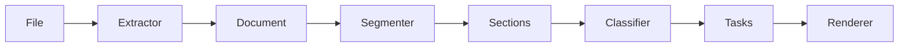

# assignment-parser

`assignment-parser` is a small Python library that turns a student assignment file (Jupyter notebook, Word document, Markdown, plain text, or video subtitles) into a structured list of **tasks**: discrete questions or instructions the student must complete.

## Architecture

The library uses a **four-stage pipeline** with a plug-in registry so you can add modalities or rules without editing core orchestration code.



1. **Extractors** read a file format and emit an ordered list of `Block` values (the natural unit of intent per modality: notebook cell, docx paragraph, transcript cue, etc.). Heading-like content is marked with `kind="heading"` and a numeric `level` for downstream segmentation.
2. **Segmenters** group blocks into a tree of `Section` objects. The default `HeadingSegmenter` uses heading blocks only; it does not care which modality produced them.
3. **Classifiers** walk blocks in document order and apply registered `ClassifierRule` instances (highest `priority` first). **First matching rule wins per block** so each block yields at most one `Task`. The default `RuleBasedClassifier` is deterministic; `LLMClassifier` is opt-in.
4. **Renderers** turn a `ParsedAssignment` into Markdown or JSON. Formatting lives only here.

**Stage 0 — registry:** `assignment_parser.registry` holds singleton lists of extractors and rules and a map of renderers. Modules register themselves at import time via `@register_extractor`, `@register_rule`, and `@register_renderer`. **Registration order matters for extractors:** the first `can_handle()` match wins, so more specific extractors (e.g. subtitles) should register before generic ones (e.g. `.txt` Markdown).

## Install

From the repository root (with a virtual environment):

```bash
pip install -e ".[dev]"
```

## Usage

**Python API**

```python
from assignment_parser import parse, render

parsed = parse("homework.ipynb")
print(render(parsed, format="markdown"))
```

**CLI**

```bash
assignment-parser homework.ipynb --format markdown -o tasks.md
assignment-parser notes.md --format json
```

Optional LLM classification (never the default):

```bash
export ASSIGNMENT_PARSER_LLM_PROVIDER=mymodule:my_llm_fn
assignment-parser file.md --use-llm --format json
```

The provider must be a `Callable[[str], str]` that returns JSON.

## Adding a modality

1. Subclass `Extractor` from `assignment_parser.models.base`.
2. Set `modality` to the appropriate `Modality` enum member.
3. Implement `can_handle(self, path: Path) -> bool` and `extract(self, path: Path) -> Document`.
4. Decorate the class with `@register_extractor` from `assignment_parser.registry`.
5. Import the module from `assignment_parser/extractors/__init__.py` **above** any extractor that might also claim the same extension.

Downstream code only sees `Document` / `Block` / `Section`; it does not need to know the original file type.

## Adding a classifier rule

1. Subclass `ClassifierRule` with a `priority` (higher runs first).
2. Implement `apply(self, block, section, context) -> Task | None`.
3. Decorate with `@register_rule`.
4. Import the module from `assignment_parser/classifiers/__init__.py` (or ensure `classifiers/rules.py` imports it) so registration runs.

Use `ClassificationContext.previous_blocks` / `next_blocks` for structural patterns that depend on neighbors.

## Data model

Callers typically use only `parse()` / `render()` and the `ParsedAssignment` graph: `Section`, `Task`, `Block`, `SourceLocation`, `TaskType`, `Modality`. Every `Task` has a `confidence` in `[0, 1]`.

## Tests

```bash
pytest
```

Integration-style tests use small fixtures under `tmp_path` and assert on the final task list and renderers.

### Testing alongside AGT multimodal grading

The **`assignment-parser` package is not yet wired into** `AGT_platform/backend/app/grading/multimodal/` (chunking still flows through `notebook_chunker.py`, template-aligned chunks, rubric routing, etc.). Until you add an integration layer, treat testing as **two complementary tracks**:

1. **This library (task list / sections)** — from the **repository root**:

   ```bash
   pip install -e ".[dev]"
   pytest tests/test_pipeline.py -q
   ```

   To sanity-check the **same student notebooks** the grader uses:

   ```bash
   assignment-parser "assignments_to_grade/[Student_1]_Week_4_Pset_4_Part_1.ipynb" --format json -o /tmp/tasks.json
   ```

   Compare section titles, task types, and `confidence` with what you expect from the notebook structure (TODOs, “try it yourself”, written prompts).

2. **AGT multimodal grading pipeline** — from **`AGT_platform/backend`** with `PYTHONPATH` including that directory (as your project normally runs tests):

   - **Fast, no live LLM:** mock pipeline class `MultimodalPipelineRunTests` (see module docstring in `tests/test_multimodal_pipeline.py`). Example:

     ```bash
     cd AGT_platform/backend
     pytest tests/test_multimodal_pipeline.py::MultimodalPipelineRunTests -q
     ```

     Set `SKIP_MOCK_MULTIMODAL_PIPELINE_TESTS=1` to skip that class when running the whole module.

   - **Full local integration** (`LocalAssignmentGradingTests`): grades everything under repo-root `assignments_to_grade/` with real LLM / HF / Ollama per env vars; requires `rubric/`, optional `answer_key/`, and writes `grading_output/` and `RAG_embedding/`. See the long docstring at the top of `test_multimodal_pipeline.py` for `MULTIMODAL_INTEGRATION_*` and skip reasons (`pytest -rs`).

**Cross-check before integration:** run `assignment-parser` JSON on an `.ipynb`, then run multimodal tests or a single grading pass on the same file; use the parser output as a **human checklist** that headings and deliverables align with how `build_notebook_qa_chunks` / template-aligned chunking split the notebook (counts and boundaries will not match one-to-one until the backends share a single segmentation source).

## Implementation notes

- **`TryItYourselfRule`** only emits a task when the code cell body is empty (whitespace only). This matches common “blank cell for your work” patterns and avoids tagging cells that already contain solution code.
- **`HeadingSegmenter`** inserts a **Preamble** section only when there are non-heading blocks before the first heading; otherwise the tree starts at the first heading section.
